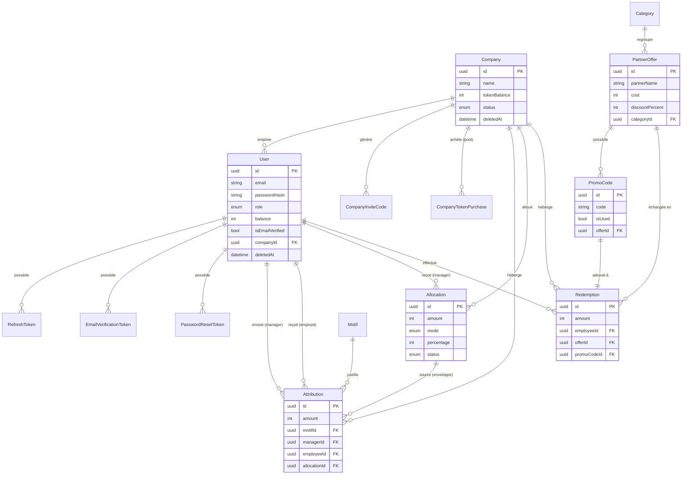

# Prim'O

> Plateforme B2B2C de récompense instantanée — « Tes efforts récompensés instantanément ! »

Prim'O permet à une entreprise d'acheter un pool de **tokens**, de les distribuer à ses employés via ses managers (avec un motif obligatoire), et à l'employé d'échanger ses tokens contre des **offres partenaires** (codes promo). Aucune conversion en argent : les tokens ne s'échangent que contre des offres.

**Stack :** React · TypeScript · Vite · Express / Node.js · PostgreSQL · Prisma · JWT · Stripe · Brevo

---

## Sommaire

- [Architecture de l'application](#architecture-de-lapplication)
- [Diagramme de la base de données](#diagramme-de-la-base-de-données)
- [Règles métier](#règles-métier)
- [Prérequis](#prérequis)
- [Installation](#installation)
- [Structure du projet](#structure-du-projet)
- [Tests](#tests)
- [Workflow Git](#workflow-git)
- [Équipe](#équipe)

---

## Architecture de l'application

Application découpée en deux : un **frontend** React (SPA, navigateur) et un **backend** Express (API REST). Ils ne partagent aucune mémoire et communiquent uniquement en **HTTP/JSON**. La base **PostgreSQL** est pilotée via l'ORM **Prisma**.

### Backend — architecture en couches

Chaque requête traverse des couches à responsabilité unique :

```
Requête HTTP
   │
   ▼
[ routes ]        mappe verbe + URL → handler, branche les middlewares
   │
   ▼
[ middleware ]    auth (JWT), autorisation (rôle), gestion d'erreurs
   │
   ▼
[ controller ]    valide l'entrée (Zod), appelle le service, met en forme la réponse
   │
   ▼
[ service ]       logique métier + accès DB (transactions atomiques)
   │
   ▼
[ Prisma ] ──▶ PostgreSQL
```

- **routes/** — définition des endpoints, aucun code métier.
- **middleware/** — `auth.middleware.ts` (vérifie le JWT), `authz.ts` (RBAC par rôle), `error.middleware.ts` (mapping centralisé code métier → statut HTTP).
- **controllers/** — glue HTTP : ne connaît rien à la DB.
- **services/** — cerveau métier + Prisma ; sans dépendance HTTP, donc testables en isolation et réutilisables (ex. jobs cron).
- **schemas/** — schémas de validation Zod (entrées) + inférence des types TypeScript.
- **lib/** — infra partagée : `db.ts` (client Prisma), `token.ts` (JWT + hash), `mail.ts` (Brevo), `stripe.ts`, `rateLimit.ts`, `upload.ts`.
- **jobs/** — tâches planifiées : anonymisation RGPD des comptes inactifs, purge des tokens expirés.

### Sécurité (transverse)

- **Authentification** JWT : access token court (15 min) + refresh token (7 j) avec **rotation** et **détection de vol** (rejeu d'un token révoqué → révocation de toute la famille).
- **Mots de passe** hachés avec **bcrypt** (coût 12, salt intégré) ; tokens hachés en **sha256** en base.
- **RBAC** (4 rôles) + **isolation multi-tenant** par `companyId` extrait du token (jamais du body).
- `helmet` (headers de sécurité), `cors` restreint au frontend, **rate limiting** par cas d'usage.
- Validation Zod au bord + contraintes `CHECK` en base (défense en profondeur).
- Access token en mémoire (protège du CSRF), refresh token en cookie **httpOnly** (protège du XSS).

### Frontend

SPA React + TypeScript (build Vite). Le client API (`services/api/`) détient l'access token **en mémoire**, rafraîchit la session silencieusement sur 401, et gère un **singleton de refresh** pour éviter les faux positifs de détection de vol. Interfaces distinctes par rôle : Employé, Manager, Patron (Owner), Admin plateforme.

---

## Diagramme de la base de données

Entités principales et relations (Prisma / PostgreSQL) :



**Points de conception clés :**

- **`Company` = frontière multi-tenant** : tout utilisateur non-ADMIN et toute ligne de ledger porte un `companyId`.
- **Modèle `User` unique** pour les 4 rôles (ADMIN / OWNER / MANAGER / EMPLOYEE) : la logique d'auth est écrite une seule fois. `role` null = utilisateur « flottant » (inscrit, pas encore rattaché à une entreprise).
- **Ledger append-only** : `Attribution` (crédit) et `Redemption` (débit). Invariant : `user.balance = Σ attributions reçues − Σ redemptions`. La balance est toujours mutée dans la même transaction que la ligne de ledger.
- **Idempotence Stripe** : `CompanyTokenPurchase.stripeSessionId` est unique → un webhook rejoué ne crédite pas deux fois.
- **Contraintes non exprimables en Prisma** (SQL brut en migration) : `CHECK` (`balance >= 0`, `amount > 0`) et index unique **partiel** sur l'email `WHERE deletedAt IS NULL` (ré-inscription possible après soft delete).
- **Soft delete** (`deletedAt`) partout + jobs RGPD d'anonymisation des comptes inactifs.

---

## Règles métier

1. Le solde de tokens ne peut **jamais** être négatif (contrainte `CHECK` en base, en plus de la validation applicative).
2. **Pas de conversion token → argent** : les tokens ne s'échangent que contre des offres partenaires.
3. Un compte nécessite une **vérification par e-mail** avant de pouvoir se connecter.
4. Chaque attribution de tokens exige un **motif** officiel (champ obligatoire).
5. Un code promo est délivré **exactement une fois** (réservation atomique, gestion de la concurrence).
6. Un manager / patron ne gère **que les employés de sa propre entreprise** (isolation par `companyId`).

---

## Prérequis

- Node.js ≥ 20
- npm ≥ 10
- PostgreSQL ≥ 15 (local, ou via le `docker-compose.yml` fourni)

---

## Installation

### 1. Cloner le dépôt

```bash
git clone <URL_DU_REPO>
cd prim-o
```

### 2. Base de données (option Docker)

```bash
docker compose up -d   # démarre PostgreSQL
```

### 3. Backend

```bash
cd backend
npm install

# Variables d'environnement
cp .env.example .env
# → Renseigner : DATABASE_URL, JWT_SECRET, CLIENT_URL, PORT, NODE_ENV,
#   STRIPE_SECRET_KEY, STRIPE_WEBHOOK_SECRET, TOKEN_PRICE_CENTS,
#   BREVO_API_KEY, BREVO_SENDER_EMAIL, BREVO_SENDERNAME

# Prisma : générer le client + appliquer les migrations
npx prisma generate
npx prisma migrate dev

# (Optionnel) Jeu de données de test
npx prisma db seed

# Lancer en dev
npm run dev
# → API sur http://localhost:4000
```

> Sans `BREVO_API_KEY`, les liens de vérification / réinitialisation sont **loggés en console** — pratique pour tester les flux e-mail en local.

### 4. Frontend

```bash
cd frontend
npm install
cp .env.example .env   # vérifier VITE_API_URL

npm run dev
# → App sur http://localhost:5173
```

---

## Structure du projet

```
prim-o/
├── backend/
│   ├── prisma/
│   │   ├── schema.prisma        # Schéma DB (entités, relations, enums)
│   │   └── migrations/          # Migrations SQL versionnées
│   ├── src/
│   │   ├── routes/              # Définition des endpoints REST
│   │   ├── middleware/          # auth, authz (RBAC), gestion d'erreurs
│   │   ├── controllers/         # Glue HTTP (parse, valide, met en forme)
│   │   ├── services/            # Logique métier + accès Prisma
│   │   ├── schemas/             # Validation Zod + types inférés
│   │   ├── lib/                 # db, token, mail, stripe, rateLimit, upload
│   │   ├── jobs/                # Tâches planifiées (RGPD, purge tokens)
│   │   ├── types/               # Déclarations TS (ex. express.d.ts)
│   │   └── server.ts            # Point d'entrée
│   └── tests/
│       ├── unit/                # Tests unitaires (Vitest)
│       └── integration/         # Tests d'intégration (Vitest + Supertest)
│
├── frontend/
│   └── src/
│       ├── pages/               # Pages par rôle (Employee, Manager, Owner, Admin…)
│       ├── components/          # Composants (auth, dashboard, offers, admin, ui…)
│       ├── hooks/               # Hooks React custom
│       ├── services/api/        # Client API typé (transport, refresh, endpoints)
│       ├── lib/                 # Helpers (format, avatars, cropImage)
│       ├── types/               # Types partagés
│       ├── router.tsx           # Routage + guards
│       └── main.tsx             # Point d'entrée
│
├── docker-compose.yml           # PostgreSQL
├── Documentation/               # Docs projet (Stages 1 à 4)
└── README.md
```

---

## Tests

| Périmètre | Outils | Localisation |
|---|---|---|
| Backend — unitaire | Vitest | `backend/tests/unit` |
| Backend — intégration (API) | Vitest + Supertest | `backend/tests/integration` |
| Frontend — composants / routing | Vitest + Testing Library | `frontend/tests`, `frontend/src/**/*.test.tsx` |

```bash
# Backend
cd backend
npm run test        # unitaires
npm run test:int    # intégration (DB de test)

# Frontend
cd frontend
npm run test
```

Portée testée : flux d'authentification, RBAC (accès autorisés/refusés par rôle), cohérence du ledger de tokens, cas de concurrence (réservation de code promo), validation des entrées. Les rate limiters sont désactivés en `NODE_ENV=test`.

> Portes de qualité exécutées localement avant merge : `tsc --noEmit` (front + back), ESLint, Vitest. La mise en place d'un pipeline CI est identifiée comme amélioration (voir `Documentation/`).

---

## Workflow Git

```
main          → production (stable)
develop       → intégration
feat/xxx      → nouvelles features   (PR vers develop)
fix/xxx       → corrections de bugs  (PR vers develop)
```

Chaque feature passe par une **Pull Request** relue avant merge dans `develop`. `develop` est fusionné dans `main` pour les livraisons.

---

## Équipe

| Nom | Rôle |
|---|---|
| Mario Colomas | PM / Backend |
| Mateo Marques | Fullstack |
| Lucas Nevano | Frontend / UX |

**Communication :** Discord · **Suivi :** Notion · **Code :** GitHub
