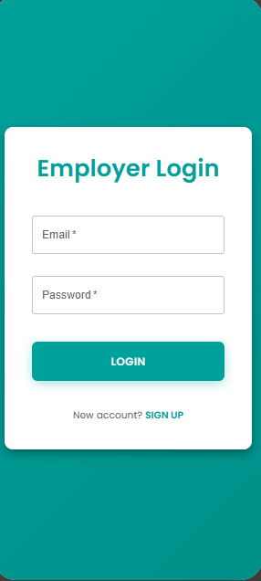

## Prim'O Logo

## Table of Content

## 3) User Stories and Mockups

### 3.1 User Stories

#### Must Have (essential for MVP)

**Employer:**
- As an employer, I want to register and log in securely, so I can access my account
- As an employer, I want to create employee accounts, so my team can use the platform
- As an employer, I want to deposit funds and convert them to tokens, so I can reward employees
- As an employer, I want to manually award tokens to employees, so I can recognize performance instantly
- As an employer, I want to view my employee list and their token balances, so I can manage rewards
- As an employer, I want to see transaction history, so I can track all token distributions

**Employee:**
- As an employee, I want to log in securely, so I can access my account
- As an employee, I want to view my token balance in real-time, so I know what I've earned
- As an employee, I want to see all available offers with token costs, so I can choose what to redeem
- As an employee, I want to redeem tokens for a promo code, so I can use the discount
- As an employee, I want to see my redemption history, so I know what I've exchanged
- As an employee, I want to receive and copy my promo code instantly, so I can use it right away

#### Should Have (important, but not critical for MVP)

- As an employer, I want to filter employees by status (active/inactive), so I can manage my team
- As an employee, I want to search and filter offers by category, so I can find what interests me
- As an employee, I want to receive notifications when tokens are awarded, so I'm always updated
- As an employer, I want to export transaction reports, so I can analyze spending

#### Could Have (nice to have, future)

- As an employee, I want to save favorite offers, so I can redeem them faster
- As an employee, I want to receive email confirmation when redeeming, so I have a record
- As an employer, I want to see sales statistics, so I can analyze business performance

#### Won't Have (excluded for MVP)

- Real-time delivery tracking (too complex for V1)
- Loyalty points or discount systems (future feature)
- Native iOS/Android app (web app + PWA instead)

---

### 3.2 Mockups (Main Screens)

We designed simple wireframes for the MVP that map routes to screens:

- /login → Login page: fields for email and password, "forgot password" link, and clear CTA to sign in.
- /signup → Signup page: registration form (name, email, password) and role selection or invitation code depending on flow.
- /employer-dashboard → Employer dashboard: shows current token balance, quick actions (deposit tokens, award tokens), employee list, and transaction history.
- /employer/award-tokens → Award tokens form: select employee, enter token amount and required reason, preview total, and confirm; includes server-side balance validation before submission.
- /employee-dashboard → Employee dashboard: displays token balance, recent receipts, and shortcuts to the offers catalogue and redemption history.
- /employee/offers → Offers catalog: searchable and filterable list of partner offers with token cost, brand, brief description, and "Redeem" button linking to the redemption flow.
- /employee/redemption → Redemption flow (receives offer via state): confirmation screen showing offer details and cost, final "Confirm" action that atomically debits tokens and returns the promo code immediately.

# Technical Architecture  Prim'O

The diagram below represents the client-server architecture of Prim'O, organized into four distinct layers.

---

## Frontend  React

The frontend is a **mobile-first responsive web app** built with React. It exposes three interfaces depending on the role of the logged-in user:

- **Admin Dashboard**  internal interface reserved for the Prim'O team. Used to manage partner offers, import promo code stocks, and monitor the platform. Access is strictly restricted and never publicly exposed.
- **Employer Dashboard**  back-office interface allowing the employer to manage their employees, deposit tokens, and assign them manually.
- **Employee Web App**  mobile interface allowing the employee to check their token balance in real time, browse the partner offers catalogue, and redeem tokens for promo codes.

The frontend communicates with the backend over **HTTPS** and receives responses in **JSON** format.

---

## Backend Server  Node.js + Express

The backend exposes a **REST API** that forms the core of the application. It is structured around three responsibilities:

- **Expose REST API endpoints**  the HTTP routes that receive requests from the frontend and route them to the appropriate logic.
- **Authentication & Authorization (JWT + bcrypt)**  every request is verified via a JWT token. Three roles are strictly isolated: Admin, Employer, and Employee. Each role has its own middleware and its own set of accessible routes. Passwords are hashed with bcrypt.
- **Apply business logic**  contains the core business logic of Prim'O:
  - **Token management**: crediting, debiting, and balance verification on every assignment or redemption.
  - **Promo code delivery**: checking available code stock and instantly assigning a code to the employee upon redemption.

---

## Database

The database layer consists of two components:

- **Prisma ORM**  a type-safe abstraction layer between the backend and the database. It translates JavaScript calls into SQL queries and ensures type consistency on both reads and writes.
- **PostgreSQL**  the relational database that stores all application data:
  - Admins, Employers & Employees (in separate tables)
  - Token transactions
  - Partner offers
  - Promotional codes and their status (available / used)

The backend sends its **SQL queries** through Prisma, which forwards them to PostgreSQL. **Results** travel back in the reverse order.

---

## External Service  Stripe

Stripe is the external service used to handle **secure payments** made by the employer when depositing tokens.

- The employer initiates a payment from the dashboard.
- Stripe processes the transaction securely.
- A **webhook** is sent to the backend to confirm the payment server-side.
- Tokens are only credited to the employer's account after the webhook confirmation is received.

This mechanism ensures that no token can ever be credited without a validated payment.

# 2) Define Components, Classes, and Database Design (MVP)

### Relational Database (MVP)

Below is a cleaned, developer-friendly view of the MVP relational schema rendered in Mermaid, followed by a compact table explaining each table's purpose and key fields. The schema is intentionally minimal and will evolve with new features (e.g. delivery tracking).

Table: What it represents — Key fields and purpose

| Table | Purpose | Key fields / notes |
|---|---|---|
| `ADMIN` | Platform administrators | `id`, `email` (unique), `passwordHash`, timestamps |
| `EMPLOYER` | Companies that deposit tokens and manage employees | `id`, `companyName`, `siret`, `email`, `tokenBalance`, verification flags, timestamps |
| `EMPLOYEE` | Company employees who receive and spend tokens | `id`, `firstName`, `lastName`, `email`, `tokenBalance`, `employerId` (FK), invitation & verification tokens |
| `REFRESH_TOKEN` | Long-lived auth tokens per user/role | `id`, `tokenHash` (store hashed), `role`, `expiresAt`, `isRevoked`, FK to owner (admin/employer/employee) |
| `TOKEN_TRANSACTION` | Records of token movements | `id`, `amount`, `reason`, `senderId` (FK), `recipientId` (FK), `createdAt` |
| `PARTNER_OFFER` | Offers available for redemption | `id`, `partnerName`, `tokenCost`, `valueEuros`, `category`, `isActive` |
| `PROMO_CODE` | Individual promo codes for offers | `id`, `code` (unique), `offerId` (FK), `isUsed`, `usedAt` |
| `EXCHANGE_HISTORY` | Tracks which promo code was given for a redemption | `id`, `tokensDebited`, `employeeId` (FK), `promoCodeId` (FK), `createdAt` |

Notes and design decisions : 
  - Store `tokenBalance` on both `EMPLOYER` and `EMPLOYEE` for quick reads, but always update via atomic DB transactions to avoid inconsistencies.
  - Promo codes are stored per `PARTNER_OFFER` and marked `isUsed` atomically during redemption to ensure a code is issued exactly once.
  - Refresh tokens should be stored hashed (`tokenHash`) and include `replacedByTokenId` to support rotation and revocation.
  - Timestamps and soft-delete (`deletedAt`) allow safe audits and easy recovery.

In short :
  - Employer/Employee = accounts holding token balances
  - TokenTransaction = transfer ledger (employer → employee, etc.)
  - PartnerOffer = catalog items redeemable with tokens
  - PromoCode = single-use code assigned on redemption
  - ExchangeHistory = link between redemption, employee and code

## User Login  JWT Authentication

.png)

1. Enter email + password  the user fills in their credentials on the login form and submits.
2. Send login request  the frontend sends the credentials to the backend via a secure HTTPS request.
3. Check user credentials  the backend queries the database through Prisma to find the matching account.
4. User found (hashed password + role)  the database returns the user row including the bcrypt-hashed password and their role.
5. bcrypt.compare(password, hash)  the backend compares the plain password against the stored hash to verify the identity without ever storing the password in clear text.
6. Return JWT token  if the credentials are valid, the backend signs and returns a JWT token containing the user's ID and role.
7. Store JWT  the frontend stores the token in an HttpOnly cookie, making it inaccessible to JavaScript and protected against XSS attacks.
8. User is logged in  the frontend redirects the user to the correct dashboard based on their role.

---

## 1. Employer  Token Management

### View token balance

1. **Open dashboard**  the employer opens their back-office interface. This action triggers an automatic request to load the current state of their account.
2. **Request balance**  the frontend sends a request to the backend to retrieve the employer's current token balance.
3. **Fetch balance**  the backend queries the database to find the token balance linked to this employer's account.
4. **Return balance**  the database sends the value back to the backend.
5. **Display current balance**  the backend forwards the balance to the frontend, which displays it in real time on the employer's dashboard.

---

### Assign tokens to employee

1. **Select employee + enter amount + reason**  the employer chooses an employee from their list, enters the number of tokens to assign, and provides a reason for the reward (e.g. "Exceeded monthly target").
2. **Send assignment request**  the frontend sends the assignment request to the backend with the employee ID, the amount, and the reason.
3. **Check employer balance >= amount**  before doing anything, the backend verifies that the employer's current token balance is greater than or equal to the amount being assigned. If not, the request is rejected.
4. **Debit employer + Credit employee**  in a single atomic database transaction, the backend deducts the tokens from the employer's balance and adds them to the employee's balance. Both operations happen at the same time  there is no state where tokens are debited but not credited, or vice versa.
5. **Transaction confirmed**  the database confirms that the transaction was saved successfully.
6. **Updated balance + confirmation**  the backend returns the new balance and a success confirmation, which the frontend displays immediately to the employer.

---

### View attribution history

1. **Open history tab**  the employer navigates to the history section of their dashboard.
2. **Request transaction history**  the frontend requests the full list of past token attributions from the backend.
3. **Fetch transactions**  the backend queries the database for all token transactions linked to this employer.
4. **Return transactions list**  the database returns the full list of transactions.
5. **Display history**  the frontend displays each attribution with its date, amount, recipient, and reason, giving the employer full visibility over every reward they have issued.

---

## 2. Employee  Token Usage & Promo Code Redemption

### View balance & received history

1. **Open dashboard**  the employee opens their mobile interface. The frontend immediately fetches their current token balance and transaction history.
2. **Request balance & history**  the frontend sends a single request to the backend to retrieve both the balance and the list of received tokens.
3. **Fetch balance & transactions**  the backend queries the database for the employee's token balance and all incoming transactions linked to their account.
4. **Return balance & history**  the database returns both sets of data to the backend.
5. **Display balance + received tokens**  the frontend shows the employee their current balance along with a history of every token they have received, including the date, amount, and the employer who sent it.

---

### Browse partner offers catalogue

1. **Open offers catalogue**  the employee navigates to the offers section to browse available rewards they can redeem their tokens for.
2. **Request offers list**  the frontend requests the list of available partner offers from the backend, potentially with filters applied (category, maximum token cost).
3. **Fetch active offers**  the backend queries the database for all offers with an active status, meaning they are currently available for redemption.
4. **Return offers**  the database returns the filtered list of active offers.
5. **Display offers**  the frontend displays each offer with the partner brand name, the token cost required to redeem it, and its real monetary value in euros.

---

### Redeem tokens for promo code

1. **Select offer + confirm redemption**  the employee selects an offer they want and confirms they want to proceed with the redemption. A confirmation step is shown before any tokens are debited.
2. **Send redemption request**  the frontend sends the redemption request to the backend with the selected offer ID.
3. **Check balance >= offer cost**  the backend verifies that the employee's current token balance is sufficient to cover the cost of the selected offer. If not, the request is rejected and no tokens are debited.
4. **Debit tokens + assign promo code**  in a single atomic transaction, the backend deducts the token cost from the employee's balance and marks one available promo code for this offer as used, linking it to this employee.
5. **Return promo code**  the database returns the assigned promo code to the backend.
6. **Display promo code + updated balance**  the frontend instantly displays the promo code to the employee along with their updated token balance. The code is available immediately with no delay.

---

## 3. Stripe  Payment Flow

### Create payment intent

1. **Enter deposit amount**  the employer enters the amount of money they want to deposit into their token wallet (e.g. 200€ = 200 tokens in V1).
2. **Submit deposit request**  the frontend sends the deposit request to the backend with the amount.
3. **Create payment intent**  the backend calls the Stripe API to create a Payment Intent. This is a Stripe object that represents the intention to collect a payment. It contains the amount, the currency, and any metadata needed.
4. **Return client_secret**  Stripe returns a `client_secret`, which is a unique temporary key that identifies this specific payment session. It is never stored  it lives only in memory for this transaction.
5. **Send client_secret**  the backend forwards the `client_secret` to the frontend so it can initialise the Stripe payment form.

---

### Employer confirms payment

1. **Stripe Elements renders secure payment form**  using the `client_secret`, the frontend initialises Stripe Elements, which renders a secure, PCI-compliant card input form directly in the browser. The card details never touch the backend  they go directly to Stripe.
2. **Enter card details + confirm**  the employer fills in their card information and clicks confirm.
3. **Confirm payment (Stripe Elements)**  Stripe processes the payment securely on their end, handling all card validation, 3D Secure authentication, and fraud detection.
4. **Result (succeeded / failed)**  Stripe returns a result to the frontend indicating whether the payment succeeded or failed. This result is informational only  the backend does not act on it directly.

---

### Webhook confirmation & token credit

1. **Webhook (payment_intent.succeeded)**  independently of the frontend result, Stripe sends an HTTP POST request (a webhook) directly to the backend to confirm the payment server-side. This is the authoritative confirmation  it cannot be faked or intercepted by the frontend.
2. **Verify webhook signature**  the backend verifies the webhook signature using the Stripe secret key. This ensures the request genuinely comes from Stripe and has not been tampered with. If the signature is invalid, the request is rejected immediately.
3. **Credit tokens to employer wallet**  only after the signature is verified does the backend credit the tokens to the employer's account in the database. This is the critical rule: tokens are never credited before this step.
4. **Balance updated**  the database confirms the balance has been updated successfully.
5. **Acknowledge webhook (200 OK)**  the backend responds to Stripe with a 200 OK to confirm the webhook was received and processed. If Stripe does not receive this, it will retry the webhook automatically.
6. **Tokens credited  dashboard updated**  the employer's dashboard reflects the new token balance, ready to be assigned to employees.